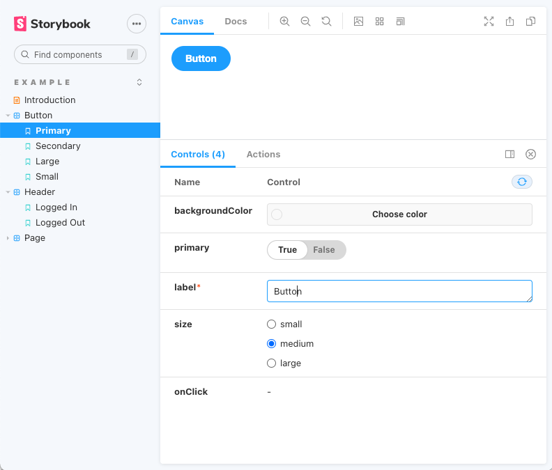
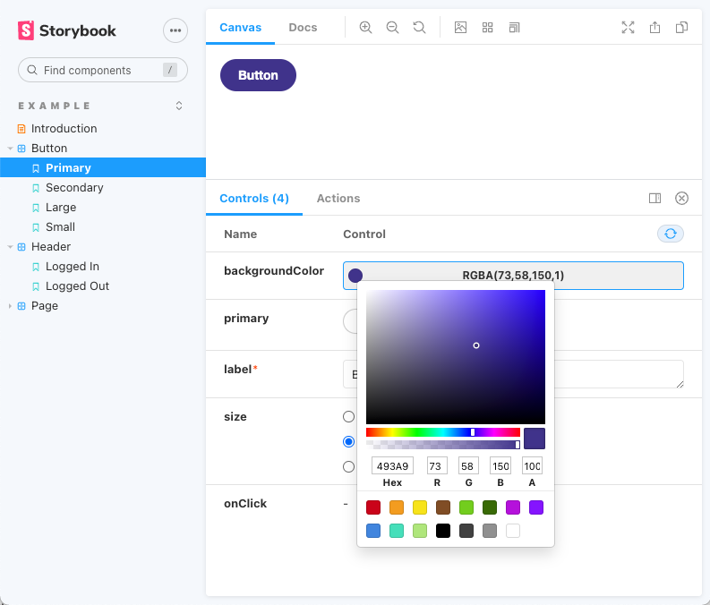

# デザイナーもエンジニアも幸せになれるスタイルガイド作成ツール「Storybook」の紹介

ReactやVue.jsなどのライブラリ/フレームワークが普及し、コンポーネント単位でUIを設計・実装するフロントエンド開発が一般的になってきました。しかし、コンポーネント単位での開発には様々な悩みポイントがあります。

コンポーネントには、単純に見た目の情報だけを持っているものもあれば、それぞれが状態を持っていてその状態によって見た目や振る舞いを変化させたりするものもあります。そういったコンポーネントは、他のコンポーネントと連携しても見た目や振る舞いが壊れないように（壊さないように）実装しなければいけません。

コンポーネント単位のフロントエンド開発には、コンポーネントを独立させて管理するスタイルガイドを作成することは必須と言っても過言ではありません。本記事では、スタイルガイドを作成するためのオープンソースツールであるStorybookを紹介します。

## Storybookとは

Storybookは、UIコンポーネントのスタイルガイド作成ツールです。実装したReactやVue.jsのコンポーネントをStorybookに登録することで、コンポーネントをアプリケーションから独立して管理できるようになります。



これは、Storybookに登録したボタンコンポーネントのスタイルガイドです。登録したコンポーネントは画面左側のリストに表示され、それぞれ詳細画面が用意されています。画面下部のControlsタブ内にあるカラーピッカーやスイッチ、ラジオボタンなどを操作することで、そのコンポーネントの見た目や振る舞いを確認できます。



## 何ができるようになるのか

コンポーネントをアプリケーションから独立して管理できるようになったことで、フロントエンド開発に携わる人々は、様々な恩恵を受けることができます。

### デザイナーがStorybookから受ける恩恵

実際にアプリケーションで動くコンポーネントと同様の見た目・振る舞いを確認できるスタイルガイドがあることで、デザイナーはプロジェクトのUIをすぐに把握できます。コンポーネントの見た目や振る舞いについて開発者と認識の齟齬があってもすぐに気づいて指摘できます。また、プロジェクトに後から参画したデザイナーがアプリケーションのUIを把握する助けにもなります。

### エンジニアがStorybookから受ける恩恵

エンジニアは、Storybookを作りながらコンポーネントを開発するので、コンポーネントの見た目や振る舞いのテストがしやすくなります。例えば、特定の条件を満たしたユーザーの画面にしか表示されないコンポーネントのテストをする状況を考えていただければわかりやすいでしょう。Storybookを使わずにそのようなテストをする場合、下記のような手順を踏む必要があります。

1. 条件を満たすユーザーのデータを作る。
2. 次にそのユーザーでアプリケーションにログインする。
3. コンポーネントが表示される想定の画面に遷移する。

このようなテストはアプリケーションの開発効率を著しく低下させます。Storybookは、コンポーネントに渡されるpropsなどの条件を「ストーリー」として保存してスタイルガイド上で再現できるため、このような問題を解決できます。

また、コンポーネントをアプリケーションから独立させて開発できるため、「あっちの画面の実装が終わらないとこっちの画面に着手できない…」のような他のエンジニアとの分業の問題が起きにくくなります。

### プロダクトオーナーがStorybookから受ける恩恵

プロダクトオーナーは、デザインや実装の受け入れ判断をする必要があります。受け入れ判断をするためには、すべてのデザインと実装に目を通す必要があります。再現に手間のかかるコンポーネントがあれば、それを再現して（もしくはエンジニアを呼び出して再現してもらって）、受け入れ判断をする必要があります。プロダクトオーナーには受け入れ判断以外にも様々な業務があり、十分に時間を取れないことが多いです。Storybookがあれば、スタイルガイドから全てのコンポーネントのすべての状態をすぐに確認できるため、受け入れ判断に要する時間を節約できます。

## セットアップ

React/TypeScriptのアプリケーションを`create-react-app`で作成し、そこにStorybookを追加する手順を紹介します。

まず、`create-react-app`でReact/TypeScriptのアプリケーションを作成します。ここでは「my-react-app」という名前で作成しています。

```shell
npx create-ract-app my-react-app --template typescript
```

次に、作成したアプリケーションのディレクトリに入り、Storybookの初期設定スクリプトを実行します。ここでは、ストーリーのフォーマットとして、Component Story Formatを指定しています。

```shell
cd my-react-app
npx -p @storybook/cli sb init --story-format=csf-ts
```

Storybookの初期設定スクリプトの実行が完了したら、`src/stories`ディレクトリが作成され、ストーリーのサンプルがいくつか作成されていることが確認できます。このコードを読んでみたり、Storybookの公式チュートリアルをやってみたりして、ストーリーの作り方を学ぶことができます。

作成したストーリーをスタイルガイドで確認したいときは、下記のコマンドを実行します。ローカルサーバーが立ち上がり、ブラウザでスタイルガイドが確認できるはずです。

```shell
yarn storybook
```

## まとめ
